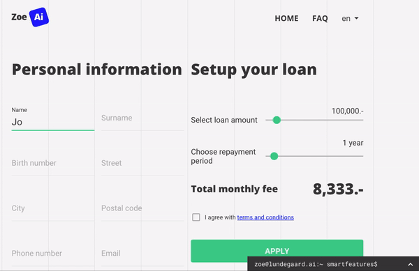

  

<h1 align="center">
  
</h1>

<h3 align="center">
🌡️ ⏰ ⚛️
</h3>

<h3 align="center"></h3>

S-Analytics Data Collector is the monitoring JavaScript code for either web or mobile platform. It collects data about visitor's behaviour and his device.

This repository shows how to integrate S-Analytics to the React application.

  <a href="https://zoe.lundegaard.ai/">Click to access the full documentation and guides for S-Analytics.</a>

  

  

  

# Example

The full example and the commentary can be found in the [`./demo`](https://github.com/lundegaard/fast-ai-zoe-demo/blob/master/demo).

